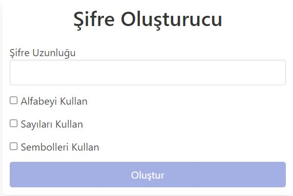
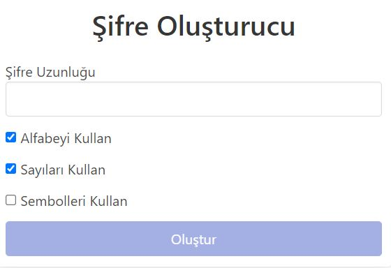
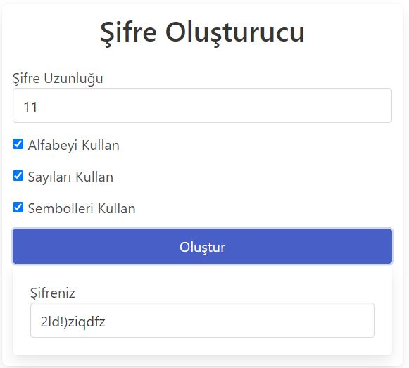

# Angular-Sifre-Olusturma-Projesi
Angular Örnek Projesi Olarak Yaptığım Şifre Oluşturma Projesi
#
- Proje, istenen özelliklere göre random bir şifre oluşturmak için tasarlandı.
- Şifre için karakter uzunluğu girilmesi gereklidir. Aksi halde "Oluştur" butonu aktif olmayacaktır.
- Şifre harf,sayı ve sembol içerebilir. Kullanıcı istediği şartı aktif edebilir.
- Oluşturulan şifrenin gözükeceği output alanı, "Oluştur" butonuna tıklanmadıkça ekranda gözükmez.
 
 #
* Proje Angular kullanılarak oluşturuldu.
* Bulma.io kullanılarak görüntü düzenlendi.
#

